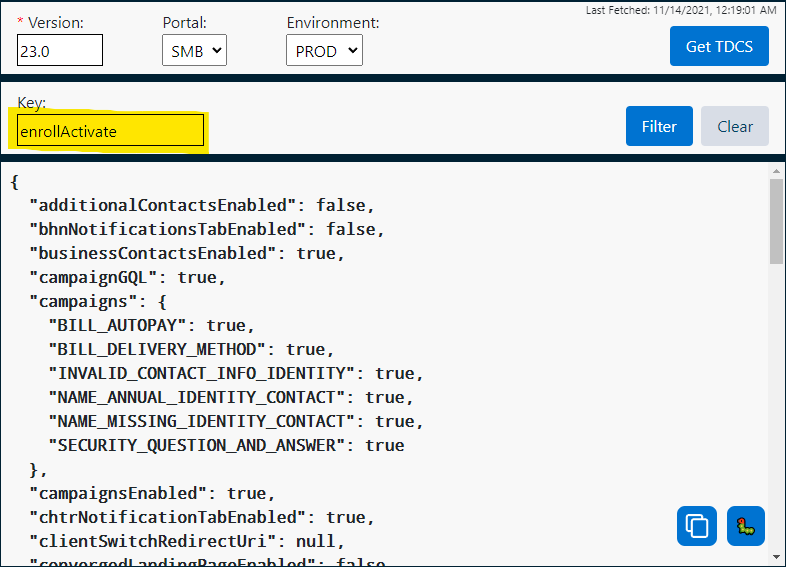
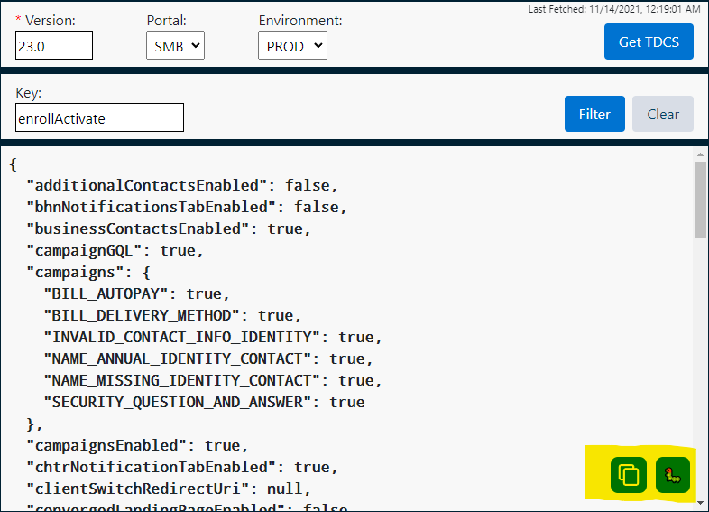

# TDCS Viewer Tool

## Installing and Running On Chrome

1. Clone this repository.
2. Install Packages `npm i`
3. Create a `.env` file and populate it with the API Urls
4. Build Extension by running `npm run build`
5. Load your extension on Chrome:
   1. Paste the following URL into your browser `chrome://extensions/`
   2. Check `Developer mode`
   3. Click on `Load unpacked extension`
   4. Select the `build` folder from this cloned repository.
6. Enjoy.

## Features

### Easily retrieve TDCS configs by entering a version and selecting the portal and environment it corresponds to.

> 

### Filter your results by a specific toggle or object in the TDCS config.

> 

### Buttons for easy copying or reporting a bug in the extension.

> 
